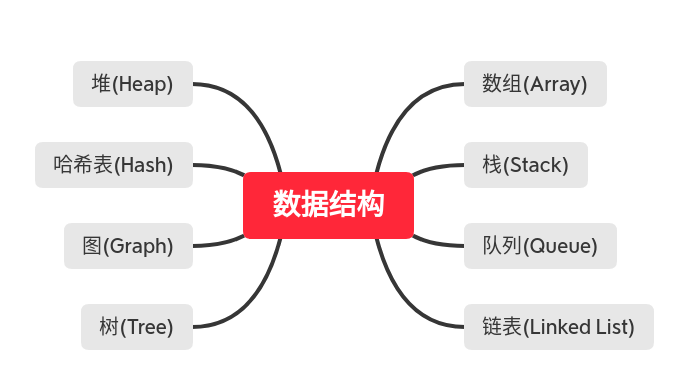
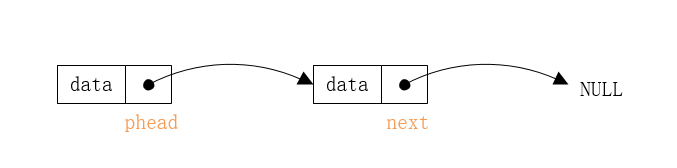
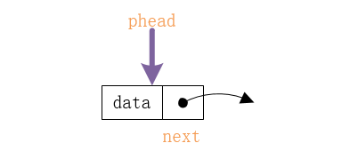
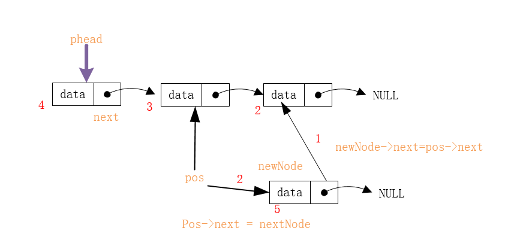
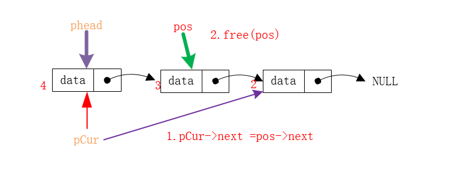
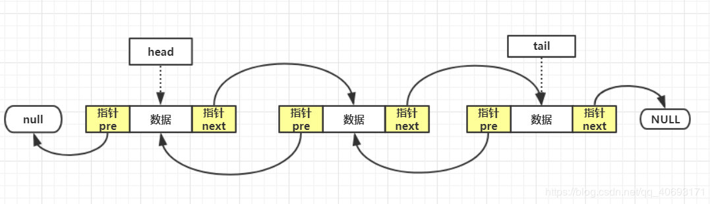
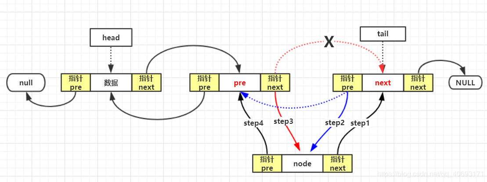
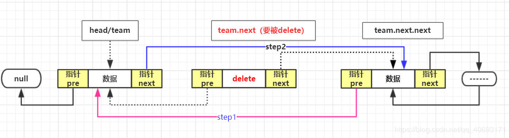

# 数据结构常考知识点整理



根据上面这张图片，数据结构主要分为八大类，又分为线性非线性两大类：
1. 线  性： 数组、栈、队列、链表
2. 非线性：  树、图、哈希表、堆

### 目录
- <a href = "#content_target_0"> 数组 </a>
  - <a href = "#content_target_0_0"> 动态数组(一维、二维) </a>
  - <a href = "#content_target_0_0"> 多维数组的遍历 </a>
- <a href = "#content_target_1"> 链表 </a>
  - <a href = "#content_target_1_0"> 单向链表及其基本操作 </a>
  - <a href = "#content_target_1_1"> 双向链表及其基本操作 </a>
  - <a href = "#content_target_1_2"> 常见链表类型题目 </a>
- <a href = "#content_target_2"> 栈 </a>
- <a href = "#content_target_3"> 队列 </a>
- <a href = "#content_target_4"> 树 </a>
- <a href = "#content_target_5"> 图 </a>
- <a href = "#content_target_6"> 哈希表 </a>
- <a href = "#content_target_7"> 堆 </a>

- <a href = "#content_target_8"> 参考/推荐博文 </a>

### 正文
从我个人的认知逻辑上来说，线性的知识更符合我们推理的习惯，所以先容易理解的线性数据结构来进行着手：

#### - <a id = "#content_target_0"> 数组 </a>

  - <a id = "#content_target_0_0"> 动态数组(一维、二维) </a>
    一般我们初始化一个数组，需要个这个数组指定大小应该是多少。
    为什么需要动态数组？：很多情况下，在预编译过程阶段，数组的长度是不能预先知道的，必须在程序运行时动态的给出，但是问题是，c++要求定义数组时，必须明确给定数组的大小，要不然编译通不过。
    ```cpp
        int nums[5];    //正确
        int n = 5;
        int nums_2[n];  // 报错，因为在编译阶段，编译器不知道 n 是多少
    ```
    正确的方式是使用 new 动态定义数组，因为new是用来开辟动态空间的，这里[C++知识点整理](../interview.md)有详细的介绍 new 和 malloc.
    ```cpp
        int n = 20;
        int *p = new int[n];    // 使用 new 动态开辟空间
    ```
    建议直接使用vector来创建数组， 因为vector的数组array实现的,也是结合动态分配内存的功能
    ```cpp
        int n = 20;
        vector<int> nums(n);
    ```
    **二维动态数组：**
    ```cpp
        // 普通形式
        int row = 10, col = 15;
        int **p = new int*[row];
        for(int i = 0 ; i < row ; ++i)
            p[i] = new int[col];

        // vector 形式
        int n = 10 , m ; 20;
        vector< vector<int> > matrix(n , vector<int>(m));
    ```

#### <a id = "#content_target_1"> 链表 </a>

[cpp文件](./linked_list.cpp)

  - <a id = "#content_target_1_0"> 单向链表及其基本操作 </a>
    
    - **单向链表一般分为两种**：
      1. 有头链表

      2. 无头链表： pHead只是一个指针，指向链表的第一个节点


    - **链表节点的定义**：(每个节点都包含数据，以及后继节点的指向)
    ```cpp
    template <typename T>
    struct Linked_Node{
        T data;                 // 节点保存的数据
        Linked_Node* next;      // 链表的写一个节点
        Linked_Node(){
            next = nullptr;    // 这样 new 一个节点时，默认next为空
        }
    }
    ```
    - **单链表插入一个节点**：(**核心**是next的顺序问题，先让新节点指向next节点，新节点在被next)

    ```cpp
    void insert_at(Linked_Node<int>*poseNode , int val）{
        assert(!poseNode);
        Linked_Node<int>* node = new Linked_Node<int>();
        // new 成功会返回对象，不成功会剖出异常 ， 不能使用 == NULL 来进行判断
        try
        {
            node->data = val;
            node->next = poseNode->next;    
            poseNode->next = node;
        }
        catch(const std::bad_alloc& e)
        {
            std::cerr << e.what() << '\n';
        }
    }
    ```
    - **单链表删除一个节点**：（**核心**是想删除当前节点，必须先找到之前当前节点的前一个节点）
    直接法: 遍历到该节点的前一个节点，然后删除该节点
    间接法: 将后一个节点的传给当前节点，删除后一个节点

    ```cpp
    /**
     * 直接删除节点 pose
     */
    void erase_at_direct(Linked_Node<int>* pHead , Linked_Node<int>* poseNode){
        assert(!pHead);
        if(pHead == nullptr || poseNode == nullptr)
            return;
        if(poseNode == pHead){
            pHead = poseNode->next;
            delete poseNode;
        }
        else{
            Linked_Node<int>* cur = pHead;
            while(cur->next && cur->next != poseNode)
                cur = cur->next;
            cur = poseNode->next;
            delete poseNode;
        }
    }
    /**
     * 通过将后一个节点的值赋值给当前节点，删除后一个节点
     */
    void erase_at_indirect( Linked_Node<int>* poseNode)
    {
        if(poseNode->next){
            Linked_Node<int>* node = poseNode->next;
            poseNode->data = node->data;
            poseNode->next = node->next;
            delete node;
        }
        else
            delete poseNode;
    }
    ```
  - <a id = "#content_target_1_1"> 双向链表及其基本操作 </a>

    双链表和单链表逻辑上没有区别，都是完成线性表的内容，主要在于结构上的区别。

    - **双链表节点的定义**：(是不是和树节点的定义很想，区别是逻辑上的使用)
    头结点的前驱节点为空 ， 尾节点的后继节点为空，这样既可以从前往后遍历，也可从后往前遍历到终点。

    ```cpp
    struct DLinked_Node
    {
        int data;
        DLinked_Node* pre;      // 前驱节点
        DLinked_Node* next;     // 后继节点
        DLinked_Node(){
            pre = nullptr;
            next = nullptr;
        }
    };
    ```

    - **双链表的插入**：(**核心**是断开的顺序和连接的顺序问题)
    头插入，尾插入，中间节点插入

    ```cpp
    /**
     * 在poseNode 后插入节点
     * 涉及到 1.头结点插入 2.尾节点插入 3.中间节点插入的
     */
    void insert_at(DLinked_Node* pHead ,DLinked_Node* pTail, DLinked_Node* poseNode , int val)
    {
        assert(!poseNode);
        DLinked_Node* pre = poseNode->pre;
        DLinked_Node* next = poseNode->next;
        DLinked_Node* node;
        node->data = val;
        if(!pre){
            // 头插入
            node->next = pHead;
            pHead = node;
        }
        else if(!next){
            // 尾插入
            pTail->next = node; // 插在尾节点后面
            node->pre = pTail;
            pTail = node;       // 尾节点后移
        }
        else{
            
            // 断开尾部，链接节点 node
            node->next = poseNode->next;    
            poseNode->next->pre = node;
            // 断开头部，链接节点 node
            node->pre = poseNode;           
            poseNode->next = node;
        }
    }
    ```
    - **双链表的删除**: (**核心**是断开节点以及链接节点)

    ```cpp
    /**
     * 删除 poseNode节点，
     * 涉及到 头删除 、 尾删除 、 中间节点删除
     */
    void insert_at(DLinked_Node* pHead ,DLinked_Node* pTail, DLinked_Node* poseNode , int val)
    {
        assert(!poseNode);
        DLinked_Node* pre = poseNode->pre;
        DLinked_Node* next = poseNode->next;
        if(!pre){
            // 头删除
            DLinked_Node* node = pHead;
            pHead = pHead->next;
            delete node;
        }
        else if(!next){
            // 尾删除
            DLinked_Node* node = pTail;
            pTail->pre->next = NULL;
            delete node;
        }
        else{
            // 中间节点删除
            poseNode->next->pre = pre;  // 图片里的 step 2
            pre->next = poseNode->next; // 图片里的 step 1
            delete poseNode;
        }
    }
    ```
  - <a id = "#content_target_1_2"> 常见链表类型题目 </a>
    在校招面试中链表类型的题目中，比较常见是单链表多一些。
    在这里我会总结一些比较经典的题目，尽量覆盖一些类型得到操作。**※越多，越重要**
    [点击这里，有完整的cpp文件](./linked_list_code.cpp)
     - **※** **链表的部分翻转：**
            (**核心**：从头到尾开始遍历，每次翻转前，先保存下一个节点)
    ```cpp
        tmp = cur->next;    // 先保存下一个,不然待会没办法指向
        cur->next = prev;   // 反向指
        prev = cur;         // prev , cur都继续往后走一步
        cur = tmp;          
    ```
     - **※** **删除链表的倒数第n个节点**
            (**核心**：快慢指针，快的先走k步，在一起走，注意细节)
    ```cpp
        for(int i = 0 ; i <= n ; ++i )
            fast = fast->next;
        while(fast->next != nullptr)
        {
            fast = fast->next;
            slow = slow->next;
        }
        Linked_Node* node = slow->next;
        slow->next = slow->next->next;
        free(node); 
    ```
    
     - **※※** **链表中去除重复元素**，保持节点的相对位置，只保留重复元素的第一个
            (**核心**：有序的比较简单，无序的需要结合容器)
    ```cpp
        if(cur->data == cur->next->data)
        {
            Linked_Node* node = cur->next;  
            cur->next = node->next;     // 保留第一个重复值，删除next
            free(node);                // 清楚野指针
        }
    ```

     - **※※※** **判断链表是否有环，以及环的入口位置**
            (**核心**：证明题，证明快慢指针第一次相遇之后，在让快指针从头开始同步走，再次相遇的位置为环形节点的入口)
            详细证明见 **参考->链表-环形表**
    ```cpp
        step1: 快慢指针判断是否有环
        step2: 根据证明，寻找入口，
    ```
     - **※※※** **奇偶链表**,链表的偶数位置的数和奇数未知的数分开放
            (**核心**：空间复杂度O(1)情况下，奇偶头指针选择之后，赋值问题)
    ```cpp
        odd->next = even->next;     // 偶位置节点的下一个为奇节点 赋值给奇结点
        odd = odd->next;            // 奇节点跳到下一个奇节点的位置   
        even->next = odd->next;     // 奇位置节点的下一个为偶节点 赋值给偶节点
        even = even->next;          // 偶节点跳到下一个偶节点的位置

    ```
#### - <a id = "#content_target_2"> 栈 </a>
#### - <a id = "#content_target_3"> 队列 </a>
    由于队列和栈有一些很类似的逻辑概念，就放在一起进行！

    - **定义**
        栈：   先进后出  ，相当于只有一个开口；
        队列： 先进先出 ， 从一头进，从另一头出；

    - **常见题**
      - **使用两个栈模拟一个队列**
      - **单调栈问题**

#### - <a id = "#content_target_8"> 参考博文 </a>

链表：
    [单链表](https://blog.csdn.net/fanyun_01/article/details/79831877)
    [双链表](https://www.cnblogs.com/bigsai/p/11351153.html)
    [环形链表](https://www.cnblogs.com/icecrea/p/12059619.html)